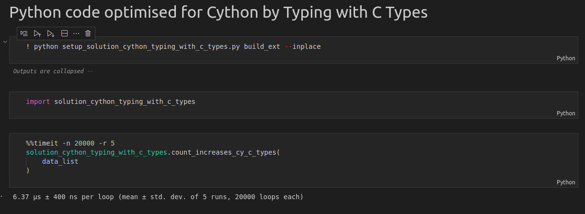
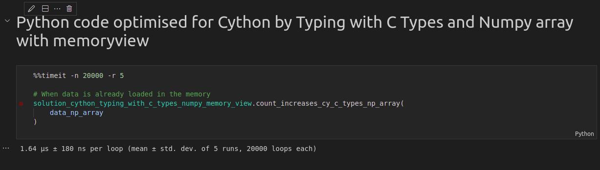

# Python - Cython Introduction

Demo of the optimisation of Pure Python code to its equivalent code in the Cython.
This project demonstrates the scope of the potential improvements/enhancements in the Python code for faster runtime.

Based on https://www.peterbaumgartner.com/blog/intro-to-just-enough-cython-to-be-useful/

___

## Installation

`python -m venv testenv`

`source testenv/bin/activate`

`python -m pip install -r requirements.txt`

___

- Pure Python Version: [`solution.py`](./src/solution.py)
- Pure Python Version with compilation (~2X faster than pure python code): [`solution_cython.pyx`](./src/solution_cython.pyx)
- Python Code optimised by addition of C Types (~8X faster than pure python code): [`solution_cython_typing_with_c_types.pyx`](./src/solution_cython_typing_with_c_types.pyx)
- Python code optimised by addition of C Types and Numpy array with memoryview (~31X faster than pure python code): [`solution_cython_typing_with_c_types_numpy_memory_view.pyx`](./src/solution_cython_typing_with_c_types_numpy_memory_view.pyx)

Demo iPython notebook that demonstrate each version: [`demo.ipynb`](./src/demo.ipynb)

___

## Steps

- Pure python code, e.g., [`solution.py`](./src/solution.py)
- Optimization Level 1: Copy the code in a file format `.pyx` to add support the Cython compilation support, e.g., [`solution_cython.pyx`](./src/solution_cython.pyx)
- Optimization Level 2: Convert the Python types to C types, e.g., [`solution_cython_typing_with_c_types.pyx`](./src/solution_cython_typing_with_c_types.pyx)
- Optimization Level 3: Use numpy array's memoryview, e.g., [`solution_cython_typing_with_c_types_numpy_memory_view.pyx`](./src/solution_cython_typing_with_c_types_numpy_memory_view.pyx)

Compile the Cython Script: `python setup.py build_ext --inplace`

___

## Result

<figure>

<figcaption align = "center"><b>Fig.1 - Time Taken in Pure Python Code Execution</b></figcaption>
</figure>

<figure>

<figcaption align = "center"><b>Fig.2 - Time Taken in Pure Python Code Execution with Compilation</b></figcaption>
</figure>

<figure>

<figcaption align = "center"><b>Fig.3 - Time Taken in Python Code Execution with C-Types</b></figcaption>
</figure>

<figure>

<figcaption align = "center"><b>Fig.4 - Time Taken in Python Code Execution with C-Types and Numpy Array Memory View</b></figcaption>
</figure>

___

## References

- [https://www.peterbaumgartner.com/blog/intro-to-just-enough-cython-to-be-useful/](https://www.peterbaumgartner.com/blog/intro-to-just-enough-cython-to-be-useful/)
- [https://cython.readthedocs.io/en/latest/src/userguide/](https://cython.readthedocs.io/en/latest/src/userguide/)
